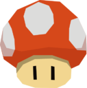

  

# MarioCraft v2
#### Autores:
- Jorge Cárdenas Cárdenas
- Ricardo Antonio Hernández Torres
- Samuel Arturo Garrido Sánchez

### Manual de Usuario

Consulte el [manual de usuario](ManualUsuario.md) para obtener una descripcion del funcionamiento del juego.

### INSTRUCCIONES PARA COMPILAR y EJECUTAR:

**PASO 1:**

Abrir la solución de Visual Studio (MarioCraft.sln)

**PASO 2:**

**SELECCIONAR ARQUITECTURA x86**, si se elige x64 habrá un error inicial.

**PASO 3:**

Compilar el subproyecto **CGALib**.

**PASO 4:**

Seleccionar el subproyecto **MarioCraft** y ejecutar una nueva instancia.

### Introducción

### Objetivo del juego

### Diseño

### Plan de trabajo

### Licenciamiento

#### Modelos implementados (con link)

- Escenario - [Link](https://skfb.ly/6VFZK)
- Casa Toad  - [Link](https://3dwarehouse.sketchup.com/model/5909ca01-6452-4743-a96a-2da59de4d93f/Mario-Toad-House)
- Castillo  - [Link](https://skfb.ly/BKKG)
- Kart  - [Link](https://skfb.ly/6Rn7G)
- Toad - [Link](https://www.models-resource.com/3ds/supermario3dland/model/12811/)
- Carretera  - [Link](https://www.models-resource.com/wii/mariokartwii/model/32084/)
- Creeper  - [Link](https://skfb.ly/6RnEO)
- Peach  - [Link](https://skfb.ly/o6DrV)
- Golem  - [Link](https://skfb.ly/6RCVI)
- Dragon  - [Link](https://skfb.ly/6Roty)
- Sol  - [Link](https://free3d.com/es/modelo-3d/sun-v2--446713.html)
- Luna  - [Link](https://free3d.com/es/modelo-3d/moon-photorealistic-2k-853071.html)
- Monedas  - [Link](https://skfb.ly/6YUOC)
- Mobs de Minecraft en General  - [Link](https://sketchfab.com/vinceyanez)
- Árbol  - [Link](https://free3d.com/es/modelo-3d/minecraft-simple-tree-4959.html)
- CasaMinecraft1  - [Link](https://3dwarehouse.sketchup.com/model/4f179c1a5075703749568b6dc5d39ae5/Minecraft-Village-House?hl=en)
- CasaMinecraft2  - [Link](https://3dwarehouse.sketchup.com/model/4f179c1a5075703749568b6dc5d39ae5/Minecraft-Village-House?hl=en)
- CasaMinecraft3  - [Link](https://skfb.ly/6vpUF)
- CasaMinecraft4  - [Link](https://sketchfab.com/3d-models/minecraft-simple-house-0ae7f28a376d4758abf9f9de30b989c1)

#### Música de fondo

[LINK PARA ARCHIVO](https://vgmsite.com/soundtracks/super-smash-bros.-ultimate-vol.-37-minecraft/aeblqycxwm/01.%20Halland%20~%20Dalarna%20%28Minecraft%20Dungeons%29.mp3)

**TÍTULO:**  Halland / Dalarna
**COMPOSITOR:** Mojang AB
**ARREGLO:** SEKAI WALKER
Producers LLC.

Composition Copyright Mojang AB

Arrangement Copyright Nintendo

<audio src="https://vgmsite.com/soundtracks/super-smash-bros.-ultimate-vol.-37-minecraft/aeblqycxwm/01.%20Halland%20~%20Dalarna%20%28Minecraft%20Dungeons%29.mp3">
  Your browser does not support the <code>audio</code> element.
</audio>

## Precio Estimado

- Estimación de costo por modelo: $30 usd x 20 = $ 600 usd
- Salario de modelador: $1500 usd x 1 = $1500 usd 
- Salario de desarrollador: $1200 usd x 2 = $2400 usd
- Licencia de 3DSMax:$1700 usd x 3 año = $ 5100 usd
- Licencia de Visual Studio: $100 x 3 usd = $300 usd
- Luz eléctrica promedio: $50 x3 usd = $150 usd
- Gasto de equipo de cómputo: $1500 usd x computadora (3) = $4500 usd
- Internet: $30 x 3 = $90 usd
- GitHub Pro: $5 x 3 = $15 usd
- Jira Software: $100

### Total
**$14755 x 1.3 de ganancia  = $19181.5 usd**

#### $380,931.19 MXN

### Desarrollo

#### Estructura general del proyecto
El proyecto fue generado utilizando el paradigma Orientado a Objetos de tal manera que cada elemento colocado en pantalla es una clase y algunos heredan atributos y métodos para que el proyecto sea más escalable y mejor estructurado.

- **dll:** Bibliotecas de Enlaces Dinámicos
- **include:** Bibliotecas generales del proyecto (headers)
- **lib:** Bibliotecas de Enlaces Estáticos
- **resources:** Modelos, imágenes y sonidos.
- **shaders:** Scripts del GPU
- **src:** Archivos fuente
  - **headers:** Definición de las clases del proyecto.
    - Model3D.h  (Clase general de todos los modelos, mejora las transformaciones, hereda de Model.h)
    - StaticModel.h (Clase para objetos estáticos, heredada de Model3D)
    - DynamicModel.h (Clase para objetos dinámicos, heredada de Model3D)
    - sound.h (Clase para el audio)
    - MarioCraft.h (Encabezado general del objeto del plano)
    - ModelManager. (Controlador de los modelos, para mandarlos al shader)
    - Lightning.h (Clase de la luz diurna)
    - Camera.h (Clase de la cámara)
    - Golem.h
    - Dragon.h
    - Kart.h
    - Peach.h
    - JumpAnimation.h (Clase para saltos generales)
    - MobMinecraft (Clase general de mobs de minecraft, para caminar solamente)
    - Vaca.h
    - Creeper.h
    - Moneda.h
  - **sources:** Contenido de las clases del proyecto.
  - **main.cpp:** Archivo principal, instancia las clases que conforman el proyecto. 
- **MarioCraft.sln:** Archivo de solución
- **MarioCraft.vcxproj:** Archivo del proyecto.

### Resultados y trabajo Futuro

### Conclusiones